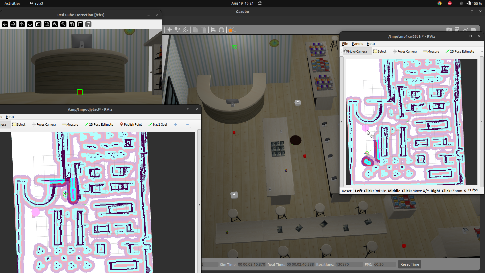
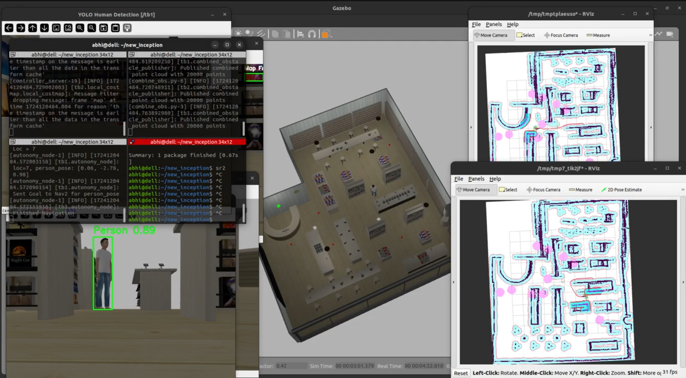

## UGV-Surveillance-with-Coordinated-Behavior-Using-Behavior-Trees

A multi‑robot Unmanned Ground Vehicle (UGV) system using behavior trees for coordinated surveillance, obstacle avoidance, and target(human) detection.

### Red Cube detection using OpenCV and Human Detection using YOLOv5


### Obstacle Detection and Update

Once a red cube is detected, it updates as an obstacle for every robot in their costmap as a pink circle.

### Navigation Towards the human

If any person is detected, the robots communicate and all the robots navigate towards the person.


Working Video: [Videos](https://drive.google.com/drive/folders/137Py9VkAu7WxhED87a7wK2qzWCGzrjDn?usp=sharing)
	
---

## Steps to run the package

1. Build the Package
	```
	colcon build
	```
2. Source the setup file
	```
	source install/setup.bash
	```

3. Initial launch	
	
	launches the world with robots and also launches NAV2 
	```
	ros2 launch inception_p0 gazebo_multi_nav2.launch.py
	```  
	

4. Open a new terminal 
    
	launches the red cube detection, yolo human detection and updates the detected red cubes as obstacles for all robots
	```
	ros2 launch inception_p0 global.launch.py
	``` 
	
5. New terminal
    
	launch the behavior tree
	```
	ros2 launch inception_p0 autonomy.launch.py
	``` 
	
    
## Description

-	On launching all the launch files, the robots will start moving around the map to the given locations in `locations.yaml` file. 
-	The robots will add the red cubes as a obstacles in the costmap which will update for both of the robots. The pink circles depict the red cubes added as obstacles. 
-	While navigating around the map if the robot detects a human using the YOLO model, the robots will stop navigating and go towards the person. 

## Behavior Tree Overview

The behavior tree is defined as following:
	- Parallel Node runs two tasks simultaneously
		1. 'CheckForPerson' detects if a person is present 
		2. 'navigate_sequence': navigates sequentially to predefined locations in the .yaml file.
	- 'GoToPose (navigate_to_person): If a person is detected, the robot will navigate to the person's location.
	
	
## Customization

- Change the spawn location of the robot in the `gazebo_multi_nav2.launch.py`. 
- We can change the radius of the hazardous zone in the `red_cube_detect.py`.
 


